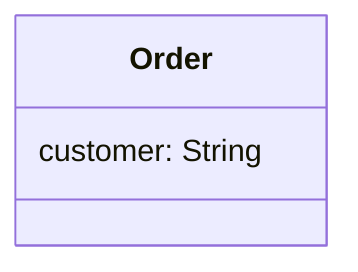
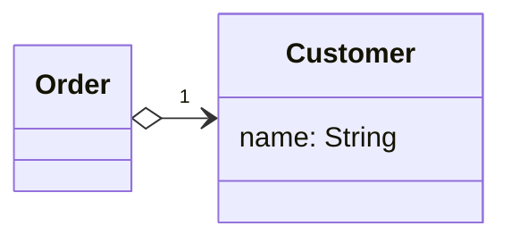

# Replace Data Value with Object

### Problem

A class (or group of classes) contains a data field. The field has its
own behavior and associated data.

### Solution

Create a new class, place the old field and its behavior in the class,
and store the object of the class in the original class.

### Why Refactor

This refactoring is basically a special case of [Extract Class](/extract-class). What makes it different is the cause of the refactoring.

In [Extract Class](/extract-class), we have a single class that's responsible for different things and we want to split up its responsibilities.

With replacement of a data value with an object, we have a primitive field (number, string, etc.) that's no longer so simple due to growth of the program and now has associated data and behaviors. On the one hand, there's nothing scary about these fields in and of themselves. However, this fields-and-behaviors family can be present in several classes simultaneously, creating duplicate code.

Therefore, for all this we create a new class and move both the field
and the related data and behaviors to it.

### Benefits

-   Improves relatedness inside classes. Data and the relevant behaviors
    are inside a single class.

### How to Refactor

Before you begin with refactoring, see if there are direct references to the field from within the class. If so, use [Self Encapsulate Field](/self-encapsulate-field) in order to hide it in the original class.

1.  Create a new class and copy your field and relevant getter to it. In addition, create a constructor that accepts the simple value of the field. This class won't have a setter since each new field value
    that's sent to the original class will create a new value object.

2.  In the original class, change the field type to the new class.

3.  In the getter in the original class, invoke the getter of the associated object.

4.  In the setter, create a new value object. You may need to also
    create a new object in the constructor if initial values had been
    set there for the field previously.
