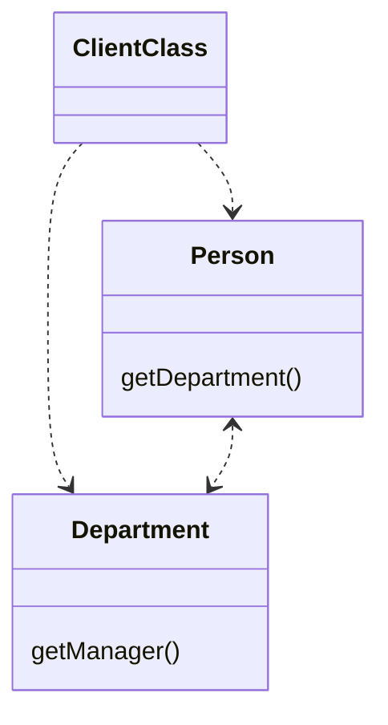
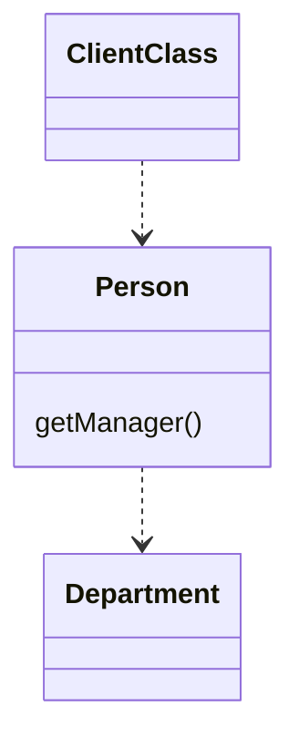

# Hide Delegate

### Problem

The client gets object B from a field or method of object А. Then the
client calls a method of object B.

### Solution

Create a new method in class A that delegates the call to object B. Now the client doesn't know about, or depend on, class B.

### Why Refactor

To start with, let's look at terminology:

-   *Server* is the object to which the client has direct access.

-   *Delegate* is the end object that contains the functionality needed
    by the client.

A call chain appears when a client requests an object from another
object, then the second object requests another one, and so on. These sequences of calls involve the client in navigation along the class structure. Any changes in these interrelationships will require changes on the client side.

### Benefits

-   Hides delegation from the client. The less that the client code
    needs to know about the details of relationships between objects,
    the easier it's to make changes to your program.

### Drawbacks

-   If you need to create an excessive number of delegating methods, *server-class* risks becoming an unneeded go-between, leading to an excess of [Middle Man](/smells/middle-man).

### How to Refactor

1.  For each method of the *delegate-class* called by the client, create a method in the *server-class* that delegates the call to the
    *delegate-class*.

2.  Change the client code so that it calls the methods of the *server-class*.

3.  If your changes free the client from needing the *delegate-class*,
    you can remove the access method to the *delegate-class* from the
    *server-class* (the method that was originally used to get the
    *delegate-class*).
