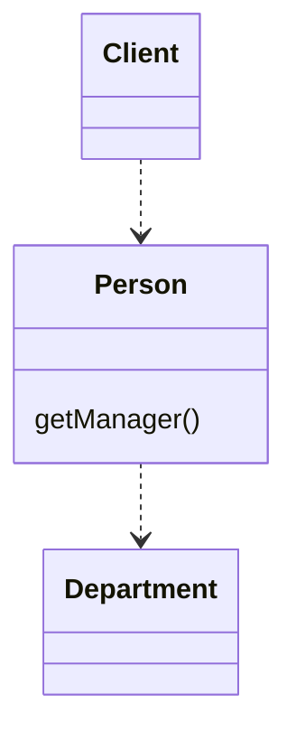
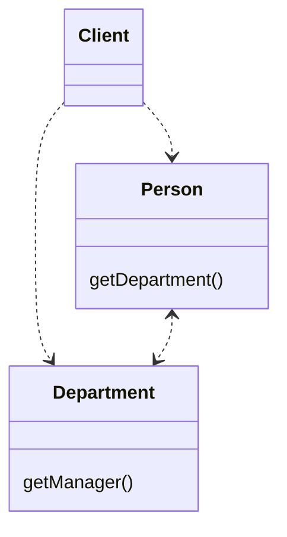

# Remove Middle Man

### Problem

A class has too many methods that simply delegate to other objects.

## Solution

Delete these methods and force the client to call the end methods

### Why Refactor

To describe this technique, we'll use the terms from [Hide
Delegate](/hide-delegate), which are:

-   *Server* is the object to which the client has direct access.

-   *Delegate* is the end object that contains the functionality needed
    by the client.

There are two types of problems:

1.  The *server-class* doesn't do anything itself and simply creates
    needless complexity. In this case, give thought to whether this
    class is needed at all.

2.  Every time a new feature is added to the *delegate*, you need to
    create a delegating method for it in the *server-class*. If a lot of
    changes are made, this will be rather tiresome.

### How to Refactor

1.  Create a getter for accessing the *delegate-class* object from the
    *server-class* object.

2.  Replace calls to delegating methods in the *server-class* with
    direct calls for methods in the *delegate-class*.
