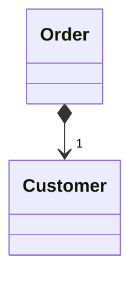
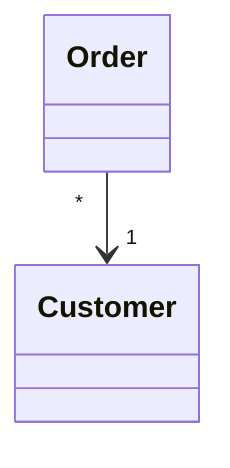

# Change Value to Reference

### Problem

So you have many identical instances of a single class that you need to replace with a single object.

### Solution

Convert the identical objects to a single reference object.

### Why Refactor

In many systems, objects can be classified as either values or
references.

-   **References**: when one real-world object corresponds to only one
    object in the program. References are usually
    user/order/product/etc. objects.

-   **Values**: one real-world object corresponds to multiple objects in
    the program. These objects could be dates, phone numbers, addresses,
    colors, and the like.

The selection of reference vs. value isn't always clear-cut. Sometimes
there's a simple value with a small amount of unchanging data. Then it
becomes necessary to add changeable data and pass these changes every
time the object is accessed. In this case it becomes necessary to
convert it to a reference.

### Benefits

-   An object contains all the most current information about a
    particular entity. If the object is changed in one part of the
    program, these changes are accessible from the other parts of the
    program that make use of the object.

### Drawbacks

-   References are much harder to implement.

### How to Refactor

1.  Use [Replace Constructor with Factory
    Method](/replace-constructor-with-factory-method) on the class from
    which the references are to be generated.

2.  Determine which object will be responsible for providing access to
    references. Instead of creating a new object, when you need one you
    now need to get it from a storage object or static dictionary field.

3.  Determine whether references will be created in advance or
    dynamically as necessary. If objects are created in advance, make
    sure to load them before use.

4.  Change the factory method so that it returns a reference. If objects
    are created in advance, decide how to handle errors when a
    non-existent object is requested. You may also need to use [Rename
    Method](/rename-method) to inform that the method returns only
    existing objects.
