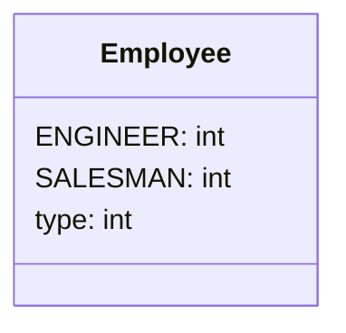
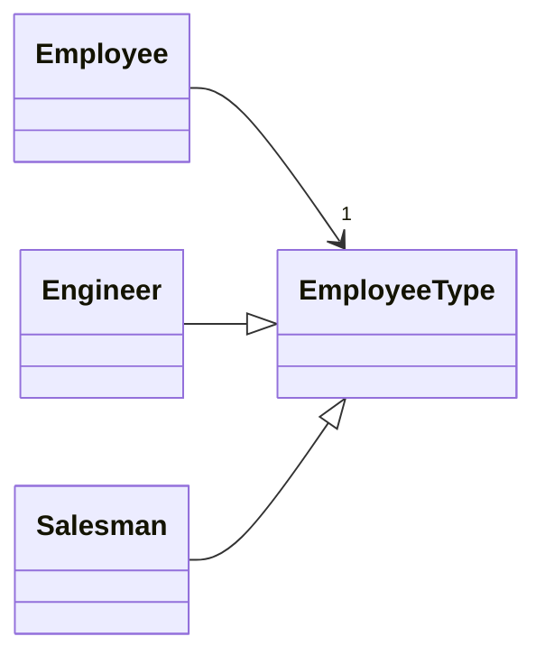

# Replace Type Code with State/Strategy

> **What's type code?** Type code occurs when, instead of a separate data type, you have a set of numbers or strings that form a list of allowable values for some entity. Often these specific numbers and strings are given understandable names via constants, which is the reason for why such type code is encountered so much.

### Problem

You have a coded type that affects behavior but you can't use subclasses to get rid of it.

### Solution

Replace type code with a state object. If it's necessary to replace a field value with type code, another state object is "plugged in".

### Why Refactor

You have type code and it affects the behavior of a class, therefore we [[fruit/Coding/Refactoring/organizing-data/replace-type-code-with-class|Replace Type Code with Class]].

Type code affects the behavior of a class but we can't create subclasses for the coded type due to the existing class hierarchy or other reasons. Thus means that we can't apply [[fruit/Coding/Refactoring/organizing-data/replace-type-code-with-subclasses|Replace Type Code with Subclasses]].

### Benefits

-   This refactoring technique is a way out of situations when a field with a coded type changes its value during the object's lifetime. In this case, replacement of the value is made via replacement of the state object to which the original class refers.

-   If you need to add a new value of a coded type, all you need to do is to add a new state subclass without altering the existing code (cf. the *Open/Closed Principle*).

### Drawbacks

-  If you have a simple case of type code but you use this refactoring technique anyway, you will have many extra (and unneeded) classes.

### Good to Know

Implementation of this refactoring technique can make use of one of two design patterns: **State** or **Strategy**. Implementation is the same no matter which pattern you choose. So which pattern should you pick in a particular situation?

If you're trying to split a conditional that controls the selection of
algorithms, use Strategy.

But if each value of the coded type is responsible not only for
selecting an algorithm but for the whole condition of the class, class state, field values, and many other actions, State is better for the job.

### How to Refactor

1.  Use [[fruit/Coding/Refactoring/organizing-data/self-encapsulate-field|Self Encapsulate Field]] to create a getter for the field that contains type code.

2.  Create a new class and give it an understandable name that fits the purpose of the type code. This class will be playing the role of *state* (or *strategy*). In it, create an abstract coded field getter.

3.  Create subclasses of the state class for each value of the coded type. In each subclass, redefine the getter of the coded field so that it returns the corresponding value of the coded type.

4.  In the abstract state class, create a static factory method that accepts the value of the coded type as a parameter. Depending on this parameter, the factory method will create objects of various states. For this, in its code create a large conditional; it'll be the only one when refactoring is complete.

5.  In the original class, change the type of the coded field to the state class. In the field's setter, call the factory state method  for getting new state objects.

6.  Now you can start to move the fields and methods from the superclass to the corresponding state subclasses (using  [[fruit/Coding/Refactoring/dealing-with-generalization/push-down-field|Push Down Field]] and [[fruit/Coding/Refactoring/dealing-with-generalization/push-down-method|Push Down Method]].

7.  When everything moveable has been moved, use [[fruit/Coding/Refactoring/simplifying-conditional-expressions/replace-conditional-with-polymorphism|Replace Conditional With Polymorphism]] in order to get rid of conditionals that use type code once and for all.
