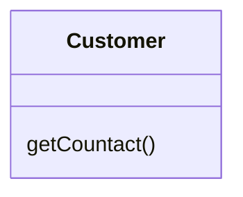
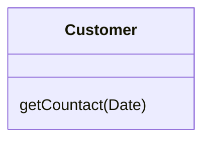

# Add Parameter

### Problem

A method doesn't have enough data to perform certain actions.

### Solution

Create a new parameter to pass the necessary data.

### Why Refactor

You need to make changes to a method and these changes require adding information or data that was previously not available to the method.

### Benefits

- The choice here is between adding a new parameter and adding a new private field that contains the data needed by the method. A parameter is preferable when you need some occasional or frequently changing data for which there's no point in holding it in an object all of the time. In this case, the refactoring will pay off. Otherwise, add a private field and fill it with the necessary data before calling the method.

### Drawbacks

-   Adding a new parameter is always easier than removing it, which is why parameter lists frequently balloon to grotesque sizes. This smell is known as the [[fruit/Coding/code smell/bloaters/long-parameter-list|Long Parameter List]].

-   If you need to add a new parameter, sometimes this means that your class doesn't contain the necessary data or the existing parameters don't contain the necessary related data. In both cases, the best solution is to consider moving data to the main class or to other classes whose objects are already accessible from inside the method.

### How to Refactor

1.  See whether the method is defined in a superclass or subclass. If the method is present in them, you will need to repeat all the steps in these classes as well.

2.  The following step is critical for keeping your program functional during the refactoring process. Create a new method by copying the old one and add the necessary parameter to it. Replace the code for the old method with a call to the new method. You can plug in any value to the new parameter (such as `null` for objects or a zero for numbers).

3.  Find all references to the old method and replace them with
    references to the new method.

4.  Delete the old method. Deletion isn't possible if the old method is part of the public interface. If that's the case, mark the old method as deprecated.
