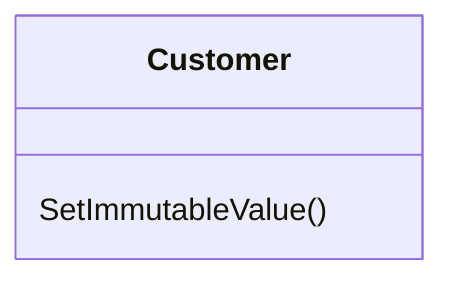

# Remove Setting Method

### Problem

The value of a field should be set only when it's created, and not
change at any time after that.

### Solution

So remove methods that set the field's value.

### Why Refactor

You want to prevent any changes to the value of a field.

### How to Refactor

1.  The value of a field should be changeable only in the constructor.
    If the constructor doesn't contain a parameter for setting the
    value, add one.

2.  Find all setter calls.

    -   If a setter call is located right after a call for the
        constructor of the current class, move its argument to the
        constructor call and remove the setter.

    -   Replace setter calls in the constructor with direct access to
        the field.

3.  Delete the setter.
