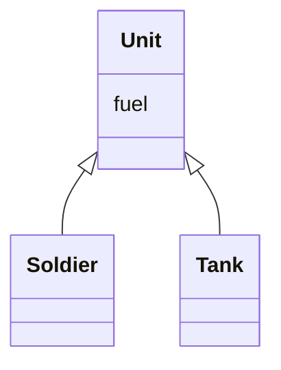
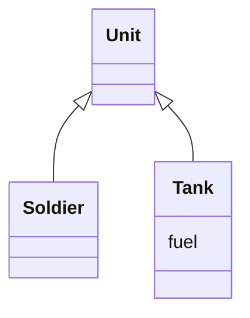

# Push Down Field

### Problem

Is a field used only in a few subclasses?

### Solution

Move the field to these subclasses.

### Why Refactor

Although it was planned to use a field universally for all classes, in reality the field is used only in some subclasses. This situation can occur when planned features fail to pan out, for example.

This can also occur due to extraction (or removal) of part of the
functionality of class hierarchies.

### Benefits

- Improves internal class coherency. A field is located where it's actually used.

- When moving to several subclasses simultaneously, you can develop the fields independently of each other. This does create code duplication, yes, so push down fields only when you really do intend to use the fields in different ways.

### How to Refactor

1. Declare a field in all the necessary subclasses.

2. Remove the field from the superclass.
