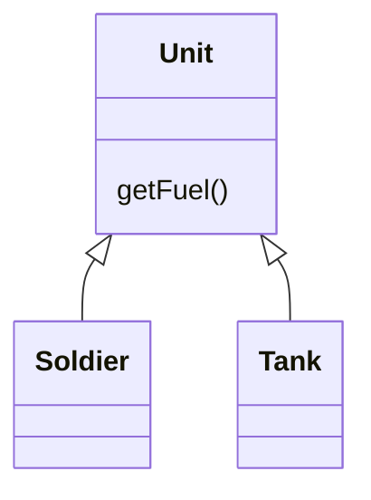
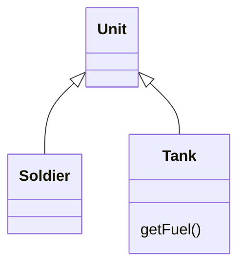

# Push Down Method

### Problem

Is behavior implemented in a superclass used by only one (or a few) subclasses?

### Solution

Move this behavior to the subclasses.

### Why Refactor

At first a certain method was meant to be universal for all classes but in reality is used in only one subclass. This situation can occur when planned features fail to materialize.

Such situations can also occur after partial extraction (or removal) of functionality from a class hierarchy, leaving a method that's used in only one subclass.

If you see that a method is needed by more than one subclass, but not all of them, it may be useful to create an intermediate subclass and move the method to it. This allows avoiding the code duplication that would result from pushing a method down to all subclasses.

### Benefits

- Improves class coherence. A method is located where you expect to see it.

### How to Refactor

1. Declare the method in a subclass and copy its code from the superclass.

2. Remove the method from the superclass.

3. Find all places where the method is used and verify that it's called from the necessary subclass.
