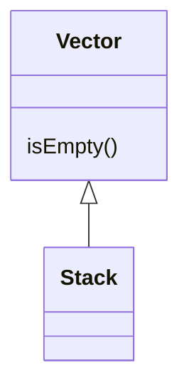
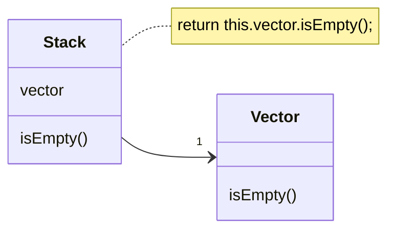

# Replace Delegation with Inheritance

### Problem

A class contains many simple methods that delegate to all methods of another class.

### Solution

Make the class a delegate inheritor, which makes the delegating methods unnecessary.

### Why Refactor

Delegation is a more flexible approach than inheritance, since it allows changing how delegation is implemented and placing other classes there as well. Nonetheless, delegation stops being beneficial if you delegate actions to only one class and all of its public methods.

In such a case, if you replace delegation with inheritance, you cleanse the class of a large number of delegating methods and spare yourself from needing to create them for each new delegate class method.

### Benefits

- Reduces code length. All these delegating methods are no longer necessary.

### When Not to Use

- Don't use this technique if the class contains delegation to only a portion of the public methods of the delegate class. By doing so, you would violate the *Liskov substitution principle*.

- This technique can be used only if the class still doesn't have parents.

### How to Refactor

1. Make the class a subclass of the delegate class.

2. Place the current object in a field containing a reference to the delegate object.

3. Delete the methods with simple delegation one by one. If their names were different, use [[fruit/Coding/Refactoring/techniques/simplifying-method-calls/rename-method|Rename Method]] to give all the methods a single name.

4. Replace all references to the delegate field with references to the current object.

5. Remove the delegate field.
