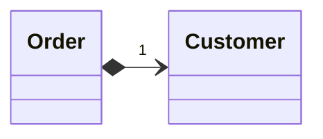
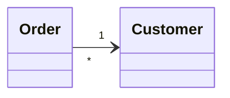

# Change Reference to Value

### Problem

You have a reference object that's too small and infrequently changed to justify managing its life cycle.

### Solution

Turn it into a value object.

### Why Refactor

Inspiration to switch from a reference to a value may come from the inconvenience of working with the reference. References require management on your part:

- They always require requesting the necessary object from storage.

- References in memory may be inconvenient to work with.

- Working with references is particularly difficult, compared to values, on distributed and parallel systems.

Values are especially useful if you would rather have  unchangeable objects than objects whose state may change during their lifetime.

### Benefits

- One important property of objects is that they should be unchangeable. The same result should be received for each query that returns an object value. If this is true, no problems arise if there are many objects representing the same thing.

- Values are much easier to implement.

### Drawbacks

- If a value is changeable, make sure if any object changes that the values in all the other objects representing the same entity are updated. This is so burdensome that it's easier to create a reference for this purpose.

### How to Refactor

1. Make the object unchangeable. The object shouldn't have any setters or other methods that change its state and data ([[fruit/Coding/Refactoring/techniques/simplifying-method-calls/remove-setting-method|Remove Setting Method]] may help here). The only place where data should be assigned to the fields of a value object is a constructor.

2. Create a comparison method to be able to compare two values.

3. Check whether you can delete the factory method and make the object constructor public.
