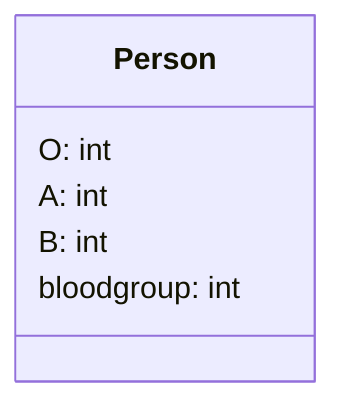
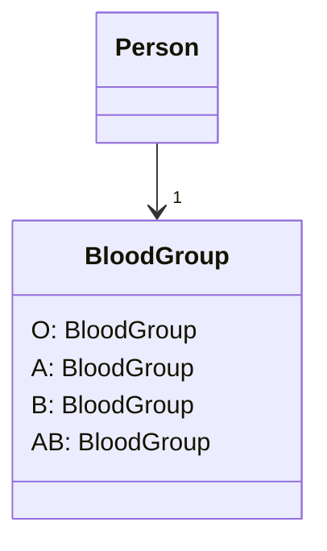

# Replace Type Code with Class

> **What's type code?** Type code occurs when, instead of a separate data type, you have a set of numbers or strings that form a list of allowable values for some entity. Often these specific numbers and strings are given understandable names via constants, which is the reason for why such type code is encountered so much.

### Problem

A class has a field that contains type code. The values of this type aren't used in operator conditions and don't affect the behavior of the program.

### Solution

Create a new class and use its objects instead of the type code values.

### Why Refactor

One of the most common reasons for type code is working with databases, when a database has fields in which some complex concept is coded with a number or string.

For example, you have the class `User` with the field `user_role`, which contains information about the access privileges of each user, whether administrator, editor, or ordinary user. So in this case, this information is coded in the field as `A`, `E`, and `U` respectively.

What are the shortcomings of this approach? The field setters often don't check which value is sent, which can cause big problems when someone sends unintended or wrong values to these fields.

In addition, type verification is impossible for these fields. It's
possible to send any number or string to them, which won't be type checked by your IDE and even allow your program to run (and crash later).

### Benefits

- We want to turn sets of primitive values---which is what coded types are---into full-fledged classes with all the benefits that object-oriented programming has to offer.

- By replacing type code with classes, we allow type hinting for values passed to methods and fields at the level of the programming language.

    For example, while the compiler previously didn't see difference between your numeric constant and some arbitrary number when a value is passed to a method, now when data that doesn't fit the indicated type class is passed, you're warned of the error inside your IDE.

- Thus we make it possible to move code to the classes of the type. If you needed to perform complex manipulations with type values throughout the whole program, now this code can "live" inside one or multiple type classes.

### When Not to Use

If the values of a coded type are used inside control flow structures (`if`, `switch`, etc.) and control a class behavior, you should use one of the two refactoring techniques for type code:

- [[fruit/Coding/Refactoring/techniques/organizing-data/replace-type-code-with-subclasses|Replace Type Code with Subclasses]]
- [[fruit/Coding/Refactoring/techniques/organizing-data/replace-type-code-with-state-strategy|Replace Type Code with State/Strategy]]

### How to Refactor

1. Create a new class and give it a new name that corresponds to the purpose of the coded type. Here we'll call it *type class*.

2. Copy the field containing type code to the *type class* and make it private. Then create a getter for the field. A value will be set for this field only from the constructor.

3. For each value of the coded type, create a static method in *type class*. It'll be creating a new *type class* object corresponding to this value of the coded type.

4. In the original class, replace the type of the coded field with
    *type class*. Create a new object of this type in the constructor as well as in the field setter. Change the field getter so that it calls the *type class* getter.

5. Replace any mentions of values of the coded type with calls of the relevant *type class* static methods.

6. Remove the coded type constants from the original class.
