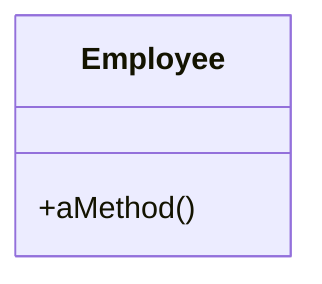
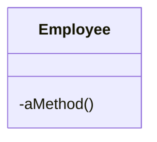

# Hide Method

### Problem

A method isn't used by other classes or is used only inside its own class hierarchy.

### Solution

Make the method private or protected.

### Why Refactor

Quite often, the need to hide methods for getting and setting values is due to development of a richer interface that provides additional behavior, especially if you started with a class that added little beyond mere data encapsulation.

As new behavior is built into the class, you may find that public getter and setter methods are no longer necessary and can be hidden. If you make getter or setter methods private and apply direct access to variables, you can delete the method.

### Benefits
- Hiding methods makes it easier for your code to evolve. When you change a private method, you only need to worry about how to not break the current class since you know that the method can't be used anywhere else.

- By making methods private, you underscore the importance of the public interface of the class and of the methods that remain public.

### How to Refactor

1. Regularly try to find methods that can be made private. Static code analysis and good unit test coverage can offer a big leg up.

2. Make each method as private as possible.
