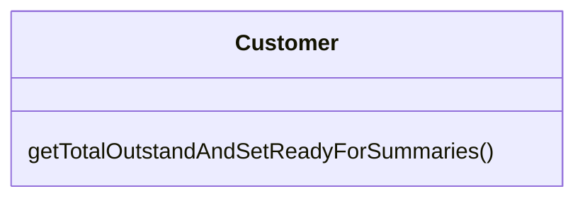
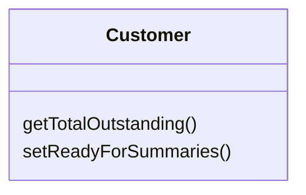

# Separate Query from Modifier

### Problem

Do you have a method that returns a value but also changes something inside an object?

### Solution

Split the method into two separate methods. As you would expect, one of them should return the value and the other one modifies the object.

### Why Refactor

This factoring technique implements *Command and Query Responsibility Segregation*. This principle tells us to separate code responsible for getting data from code that changes something inside an object.

Code for getting data is named a *query*. Code for changing things in the *visible state* of an object is named a *modifier*. When a *query* and *modifier* are combined, you don't have a way to get data without making changes to its condition. In other words, you ask a question and can change the answer even as it's being received. This problem becomes even more severe when the person calling the query may not know about the method's "side effects", which often leads to runtime errors.

But remember that side effects are dangerous only in the case of
*modifiers* that change the **visible** state of an object. These could
be, for example, fields accessible from an object's public interface, entry in a database, in files, etc. If a *modifier* only caches a complex operation and saves it within the private field of a class, it can hardly cause any side effects.

### Benefits

- If you have a *query* that doesn't change the state of your program, you can call it as many times as you like without having to worry about unintended changes in the result caused by the mere fact of you calling the method.

### Drawbacks

- In some cases it's convenient to get data after performing a command. For example, when deleting something from a database you want to know how many rows were deleted.

### How to Refactor

1. Create a new *query method* to return what the original method did.

2. Change the original method so that it returns only the result of calling the new *query method*.

3. Replace all references to the original method with a call to the *query method*. Immediately before this line, place a call to the *modifier method*. This will save you from side effects in case if the original method was used in a condition of a conditional operator or loop.

4. Get rid of the value-returning code in the original method, which now has become a proper *modifier method*.
