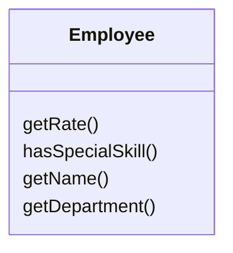
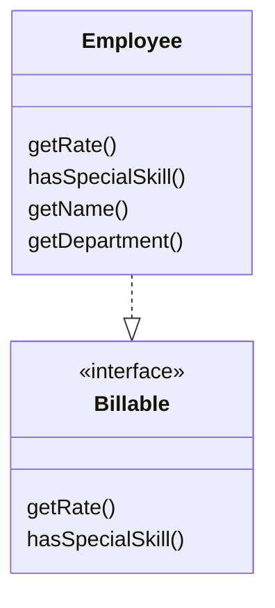

# Extract Interface

### Problem

Multiple clients are using the same part of a class interface. Another
case: part of the interface in two classes is the same.

### Solution
Billable
Move this identical portion to its own interface.

### Why Refactor

1.  Interfaces are very apropos when classes play special roles in
    different situations. Use [Extract Interface](/extract-interface) to explicitly indicate which role.

2.  Another convenient case arises when you need to describe the
    operations that a class performs on its server. If it's planned to
    eventually allow use of servers of multiple types, all servers must
    implement the interface.

### Good to Know

There's a certain resemblance between [Extract Superclass](/extract-superclass) and [Extract Interface](/extract-interface).

Extracting an interface allows isolating only common interfaces, not
common code. In other words, if classes contain [Duplicate Code](/smells/duplicate-code), extracting the interface won't help you to deduplicate.

All the same, this problem can be mitigated by applying [Extract Class](/extract-class) to move the behavior that contains the duplication to a separate component and delegating all the work to it. If the common behavior is large in size, you can always use [Extract
Superclass](/extract-superclass). This is even easier, of course, but remember that if you take this path you will get only one parent class.

### How to Refactor

1.  Create an empty interface.

2.  Declare common operations in the interface.

3.  Declare the necessary classes as implementing the interface.

4.  Change type declarations in the client code to use the new
    interface.
