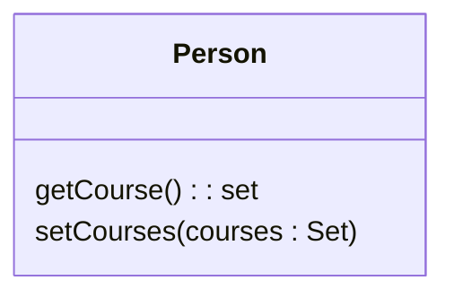
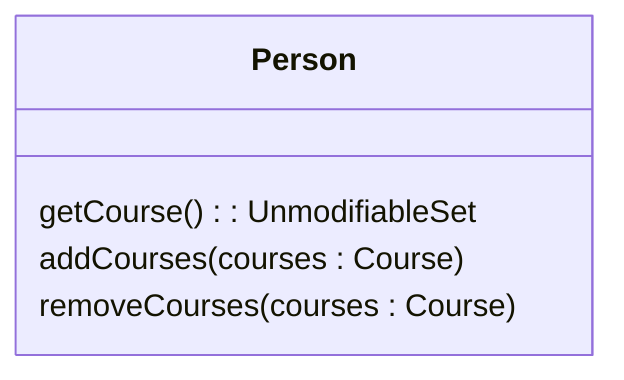

# Encapsulate Collection

### Problem

A class contains a collection field and a simple getter and setter for
working with the collection.

### Solution

Make the getter-returned value read-only and create methods for
adding/deleting elements of the collection.

### Why Refactor

A class contains a field that contains a collection of objects. This
collection could be an array, list, set or vector. A normal getter and
setter have been created for working with the collection.

But the collections should be used by a protocol that's a bit different
from the one used by other data types. The getter method shouldn't
return the collection object itself, since this would let clients change
collection contents without the knowledge of the owner class. In
addition, this would show too much of the internal structures of the
object data to clients. The method for getting collection elements
should return a value that doesn't allow changing the collection or
disclose excessive data about its structure.

In addition, there shouldn't be a method that assigns a value to the
collection. Instead, there should be operations for adding and deleting
elements. Thanks to this, the owner object gains control over addition
and deletion of collection elements.

Such a protocol properly encapsulates a collection, which ultimately
reduces the degree of association between the owner class and the client
code.

### Benefits

-   The collection field is encapsulated inside a class. When the getter
    is called, it returns a copy of the collection, which prevents
    accidental changing or overwriting of the collection elements
    without the knowledge of the class that contains the collection.

-   If collection elements are contained inside a primitive type, such
    as an array, you create more convenient methods for working with the
    collection.

-   If collection elements are contained inside a non-primitive
    container (standard collection class), by encapsulating the
    collection you can restrict access to unwanted standard methods of
    the collection (such as by restricting addition of new elements).

### How to Refactor

1.  Create methods for adding and deleting collection elements. They
    must accept collection elements in their parameters.

2.  Assign an empty collection to the field as the initial value if this
    isn't done in the class constructor.

3.  Find the calls of the collection field setter. Change the setter so
    that it uses operations for adding and deleting elements, or make
    these operations call client code.

Note that setters can be used only to replace all collection elements
with other ones. Therefore it may be advisable to change the setter name
([Rename Method](/rename-method)) to `replace`.

4.  Find all calls of the collection getter after which the collection
    is changed. Change the code so that it uses your new methods for
    adding and deleting elements from the collection.

5.  Change the getter so that it returns a read-only representation of
    the collection.

6.  Inspect the client code that uses the collection for code that would
    look better inside of the collection class itself.
