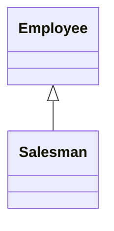
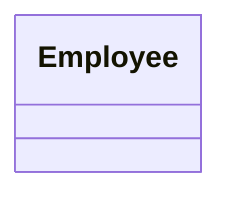

# Collapse Hierarchy
### Problem

You have a class hierarchy in which a subclass is practically the same as its superclass.

### Solution

Merge the subclass and superclass.

### Why Refactor

Your program has grown over time and a subclass and superclass have become practically the same. A feature was removed from a subclass, a method was moved to the superclass\... and now you have two look-alike classes.

### Benefits

-   Program complexity is reduced. Fewer classes mean fewer things to keep straight in your head and fewer breakable moving parts to worry about during future code changes.

-   Navigating through your code is easier when methods are defined in one class early. You don't need to comb through the entire hierarchy to find a particular method.

### When Not to Use

-   Does the class hierarchy that you're refactoring have more than one subclass? If so, after refactoring is complete, the remaining subclasses should become the inheritors of the class in which the hierarchy was collapsed.

-   But keep in mind that this can lead to violations of the *Liskov
    substitution principle*. For example, if your program emulates city
    transport networks and you accidentally collapse the `Transport`
    superclass into the `Car` subclass, then the `Plane` class may
    become the inheritor of `Car`. Oops!

### How to Refactor

1.  Select which class is easier to remove: the superclass or its
    subclass.

2.  Use [Pull Up Field](/pull-up-field) and [Pull Up
    Method](/pull-up-method) if you decide to get rid of the subclass.
    If you choose to eliminate the superclass, go for [Push Down
    Field](/push-down-field) and [Push Down Method](/push-down-method).

3.  Replace all uses of the class that you're deleting with the class to
    which the fields and methods are to be migrated. Often this will be
    code for creating classes, variable and parameter typing, and
    documentation in code comments.

4.  Delete the empty class.
