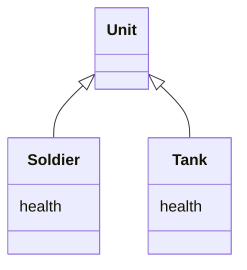
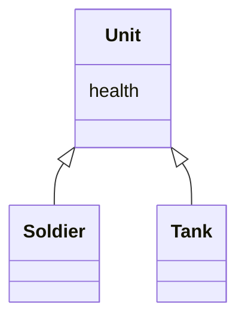

# Pull Up Field

### Problem

Two classes have the same field.

### Solution

Remove the field from subclasses and move it to the superclass.

### Why Refactor

Subclasses grew and developed separately, causing identical (or nearly
identical) fields and methods to appear.

### Benefits

-   Eliminates duplication of fields in subclasses.

-   Eases subsequent relocation of duplicate methods, if they exist,
    from subclasses to a superclass.

### How to Refactor

1.  Make sure that the fields are used for the same needs in subclasses.

2.  If the fields have different names, give them the same name and
    replace all references to the fields in existing code.

3.  Create a field with the same name in the superclass. Note that if
    the fields were private, the superclass field should be protected.

4.  Remove the fields from the subclasses.

5.  You may want to consider using [Self Encapsulate
    Field](/self-encapsulate-field) for the new field, in order to hide
    it behind access methods.
