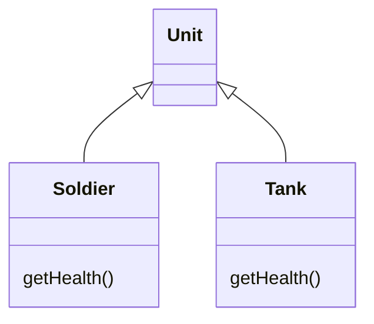
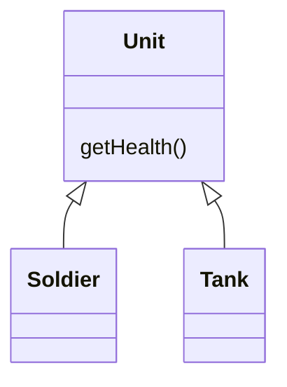

# Pull Up Method

### Problem

Your subclasses have methods that perform similar work.

### Solution

Make the methods identical and then move them to the relevant
superclass.

### Why Refactor

Subclasses grew and developed independently of one another, causing
identical (or nearly identical) fields and methods.

### Benefits

-   Gets rid of duplicate code. If you need to make changes to a method,
    it's better to do so in a single place than have to search for all
    duplicates of the method in subclasses.

-   This refactoring technique can also be used if, for some reason, a
    subclass redefines a superclass method but performs what's
    essentially the same work.

### How to Refactor

1.  Investigate similar methods in superclasses. If they aren't
    identical, format them to match each other.

2.  If methods use a different set of parameters, put the parameters in
    the form that you want to see in the superclass.

3.  Copy the method to the superclass. Here you may find that the method
    code uses fields and methods that exist only in subclasses and
    therefore aren't available in the superclass. To solve this, you
    can:

    -   For fields: use either [Pull Up Field](/pull-up-field) or
        Self-[Encapsulate Field](/encapsulate-field) to create getters
        and setters in subclasses; then declare these getters abstractly
        in the superclass.

    -   For methods: use either [Pull Up Method](/pull-up-method) or
        declare abstract methods for them in the superclass (note that
        your class will become abstract if it wasn't previously).

4.  Remove the methods from the subclasses.

5.  Check the locations in which the method is called. In some places
    you may be able to replace use of a subclass with the superclass.
