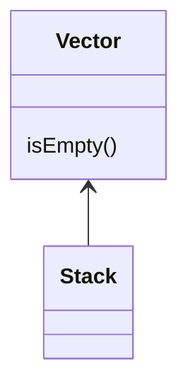
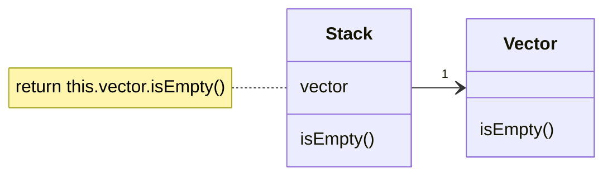

# Replace Inheritance with Delegation

### Problem

You have a subclass that uses only a portion of the methods of its
superclass (or it's not possible to inherit superclass data).

### Solution

Create a field and put a superclass object in it, delegate methods to
the superclass object, and get rid of inheritance.

### Why Refactor

Replacing inheritance with composition can substantially improve class design if:

-   Your subclass violates the *Liskov substitution principle*, i.e., if
    inheritance was implemented only to combine common code but not because the subclass is an extension of the superclass.

-   The subclass uses only a portion of the methods of the superclass. In this case, it's only a matter of time before someone calls a superclass method that he or she wasn't supposed to call.

In essence, this refactoring technique splits both classes and makes the superclass the helper of the subclass, not its parent. Instead of
inheriting all superclass methods, the subclass will have only the
necessary methods for delegating to the methods of the superclass
object.

### Benefits

-   A class doesn't contain any unneeded methods inherited from the superclass.

-   Various objects with various implementations can be put in the
    delegate field. In effect you get the [Strategy](/design-patterns/strategy) design pattern.

### Drawbacks

-   You have to write many simple delegating methods.

### How to Refactor

1.  Create a field in the subclass for holding the superclass. During
    the initial stage, place the current object in it.

2.  Change the subclass methods so that they use the superclass object instead of `this`.

3.  For methods inherited from the superclass that are called in the
    client code, create simple delegating methods in the subclass.

4.  Remove the inheritance declaration from the subclass.

5.  Change the initialization code of the field in which the former
    superclass is stored by creating a new object.
