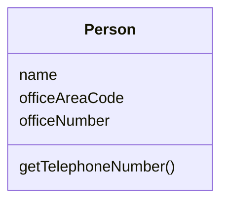
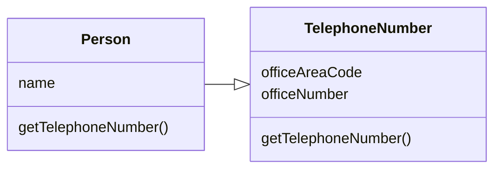

# Extract Class

### Problem

When one class does the work of two, awkwardness results.

### Solution

Instead, create a new class and place the fields and methods responsible
for the relevant functionality in it.

### Why Refactor

Classes always start out clear and easy to understand. They do their job
and mind their own business as it were, without butting into the work of
other classes. But as the program expands, a method is added and then a
field\... and eventually, some classes are performing more
responsibilities than ever envisioned.

### Benefits

-   This refactoring method will help maintain adherence to the *Single
    Responsibility Principle*. The code of your classes will be more
    obvious and understandable.

-   Single-responsibility classes are more reliable and tolerant of
    changes. For example, say that you have a class responsible for ten
    different things. When you change this class to make it better for
    one thing, you risk breaking it for the nine others.

### Drawbacks

-   If you "overdo it" with this refactoring technique, you will have to
    resort to [Inline Class](/inline-class).

### How to Refactor

Before starting, decide on how exactly you want to split up the
responsibilities of the class.

1.  Create a new class to contain the relevant functionality.

2.  Create a relationship between the old class and the new one.
    Optimally, this relationship is unidirectional; this allows reusing
    the second class without any issues. Nonetheless, if you think that
    a two-way relationship is necessary, this can always be set up.

3.  Use [Move Field](/move-field) and [Move Method](/move-method) for
    each field and method that you have decided to move to the new
    class. For methods, start with private ones in order to reduce the
    risk of making a large number of errors. Try to relocate just a
    little bit at a time and test the results after each move, in order
    to avoid a pileup of error-fixing at the very end.

    After you're done moving, take one more look at the resulting
    classes. An old class with changed responsibilities may be renamed
    for increased clarity. Check again to see whether you can get rid of
    two-way class relationships, if any are present.

4.  Also give thought to accessibility to the new class from the
    outside. You can hide the class from the client entirely by making
    it private, managing it via the fields from the old class.
    Alternatively, you can make it a public one by allowing the client
    to change values directly. Your decision here depends on how safe
    it's for the behavior of the old class when unexpected direct
    changes are made to the values in the new class.
