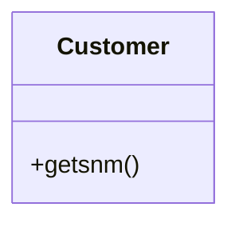
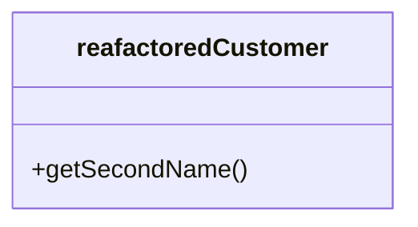

# Rename Method

### Problem

The name of a method doesn't explain what the method does.

### Solution

Rename the method.

### Why Refactor

Perhaps a method was poorly named from the very beginning---for example,
someone created the method in a rush and didn't give proper care to
naming it well.

Or perhaps the method was well named at first but as its functionality
grew, the method name stopped being a good descriptor.

### Benefits

-   Code readability. Try to give the new method a name that reflects
    what it does. Something like `createOrder()`,
    `renderCustomerInfo()`, etc.

### How to Refactor

1.  See whether the method is defined in a superclass or subclass. If
    so, you must repeat all steps in these classes too.

2.  The next method is important for maintaining the functionality of
    the program during the refactoring process. Create a new method with
    a new name. Copy the code of the old method to it. Delete all the
    code in the old method and, instead of it, insert a call for the new
    method.

3.  Find all references to the old method and replace them with
    references to the new one.

4.  Delete the old method. If the old method is part of a public
    interface, don't perform this step. Instead, mark the old method as
    deprecated.
